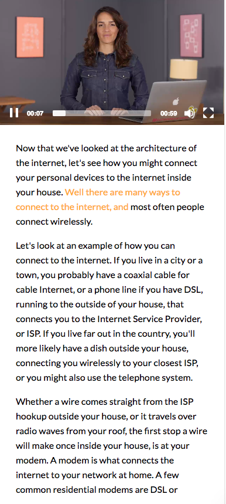
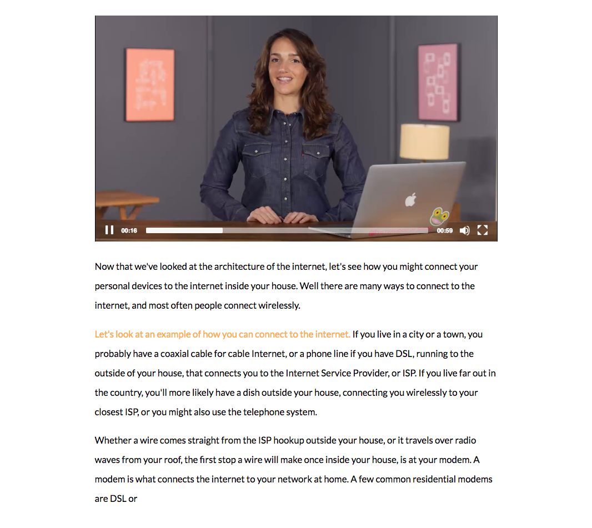

# Techdegree Project 6

## Requirements
1.  Use a Video player
2.  Add the transcription under the video that highlights the spoken part of the text
3.  If you click on the transcription it will take you to that part of the video
4.  Make it look like the mockups

## Mockups
### Mobile

### Tablet / Desktop

